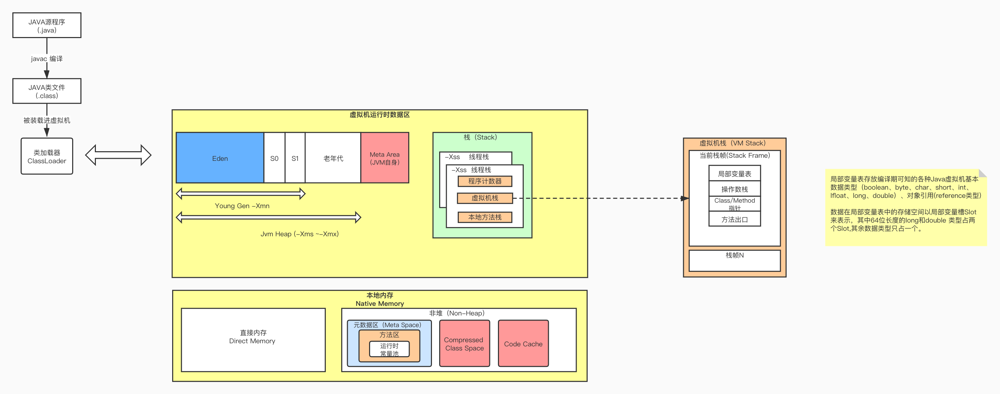

## 第一周学习学习笔记

#### 作业1: 自定义一个 Classloader，加载一个 Hello.xlass 文件，执行 hello 方法， 此文件内容是一个 Hello.class 文件所有字节(x=255-x)处理后的文件。

思路: 
1. 自定义Classloader，通常是继承java.lang.ClassLoader 类，并重写 findClass()方法；
2. 字节 x=255-x，字节表示范围0~255，还原回去用255-x;

[传送门](./src/Xlassloader.java)


#### 作业2: 画一张图，展示 Xmx、Xms、Xmn、Metaspache、DirectMemory、Xss 这些内存参数的关系。




#### 作业3: 自己写一个简单的 Hello.java，里面需要涉及基本类型，四则运行，if 和for，然后自己分析一下对应的字节码;

[传送门](./src/HelloWorld.java)

字节码（Java Bytecode）
---

[字节码对照表](https://www.cnblogs.com/tsvico/p/12708417.html)


```
javac XX.java
javap -c -verbose XX.class
javap -c -v XX.class
```

#### 2. 分类:
- 栈操作指令，包括和局部变量的交互；

```
iconst_1  将int型1推送至栈顶
istore_1  将栈顶int型数值存入第二个本地变量
astore_0  将栈顶引用型数值存入第一个本地变量
ldc 将int,float或String型常量值从常量池中推送至栈顶
dup	复制栈顶数值并将复制值压入栈顶

```
- 程序流控制指令；
```
 goto          51
 if_icmpge	比较栈顶两int型数值大小, 当结果大于等于0时跳转
 
```
- 对象操作指令,包括对方法的调用；
```
 new           #8                  // class HelloWorld
 invokevirtual #7                  // Method java/io/PrintStream.println:(I)V
```
- 算术运算及类型转换指令；

```
iinc	将指定int型变量增加指定值(如i++, i--, i+=2等)
add ,sub , mul, div, rem 取模，neg 取负
shl 左移， shr 右移
ior 按位或, iand 按位与
x2x 从某个类型转换成某个类型